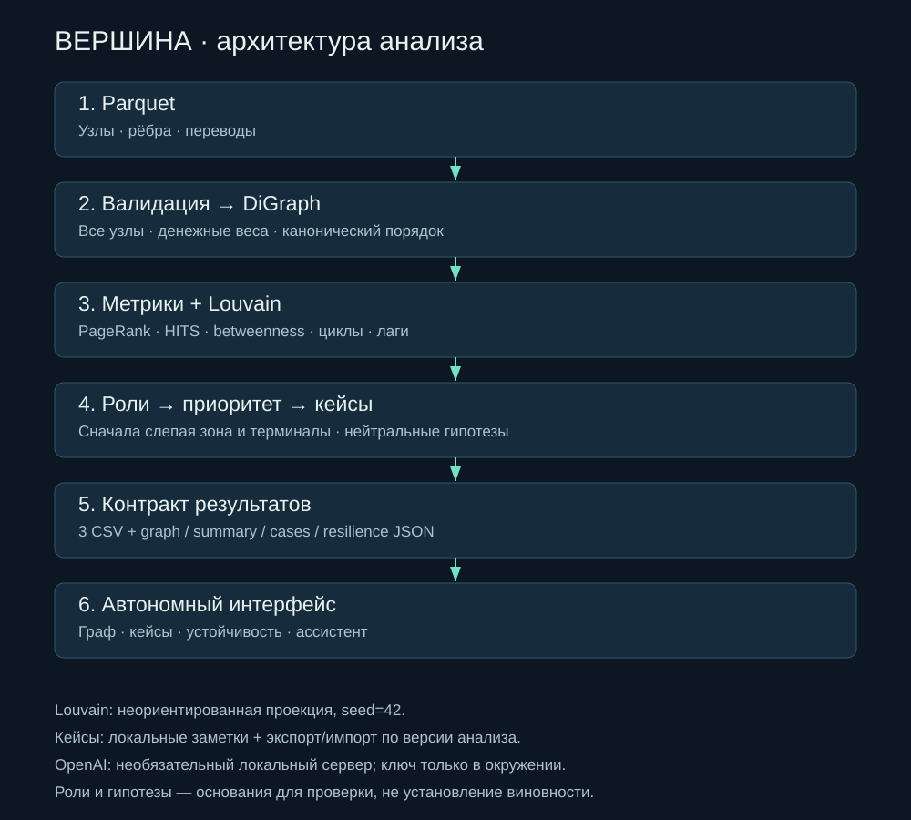
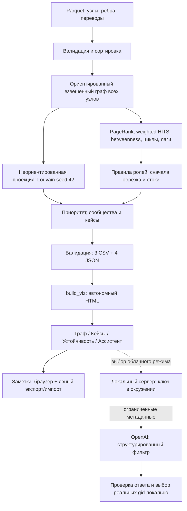

# Архитектура Vertex

Роли и гипотезы описывают наблюдаемые признаки, не виновность.

CSV: nodes_roles, clusters, top_nodes. JSON: graph, summary, cases, resilience.
Симуляция удаляет узлы только в модели. Гипотезы CSV и офлайн-ассистент работают без LLM.
Кейсы основаны на сообществах; до 12 наблюдаемых переводов на карточку, полное число показано отдельно.
Состояние кейса не хранится в Git и не синхронизируется само.
